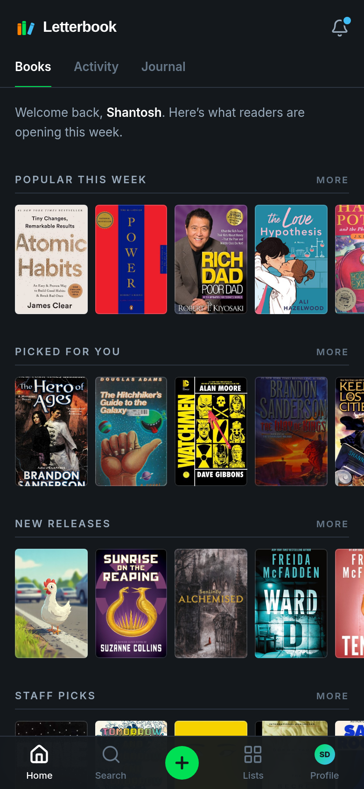
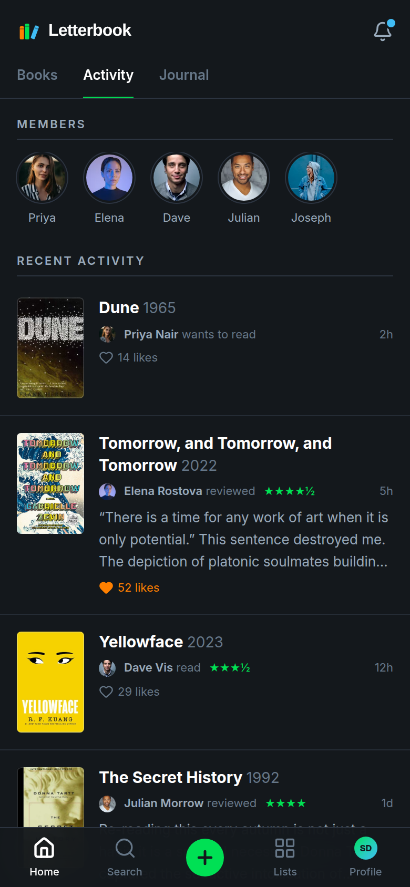
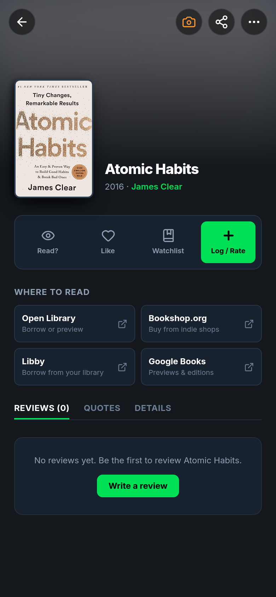
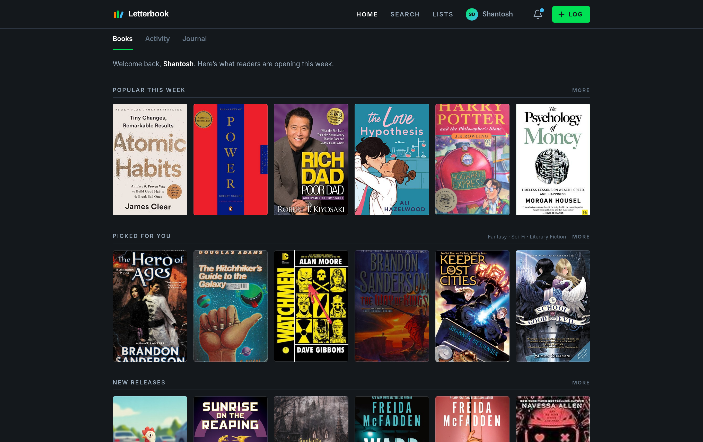

<p align="center">
  
</p>

<h1 align="center">Letterbook</h1>

<p align="center">
  A free, open-source reading diary. Log the books you read, rate and review them,
  keep lists, and share your ratings to Instagram Stories.
  <br />
  <a href="https://shantoshdurai.github.io/Letterbook/"><strong>Open the web app</strong></a>
  ·
  <a href="https://github.com/shantoshdurai/Letterbook/releases/latest">Download the Android APK</a>
  ·
  <a href="https://github.com/shantoshdurai/Letterbook/issues">Report a bug</a>
</p>

<p align="center">
  
  &nbsp;
  
  &nbsp;
  
</p>
<p align="center">
  
</p>

## Inspired by Letterboxd

Letterbook exists because [Letterboxd](https://letterboxd.com) made logging films a joy,
and books deserved the same. Its design borrows from Letterboxd: the dark slate palette,
the orange, green and blue accents, poster rows, the diary, star ratings with halves,
and Story cards for sharing a rating.

Letterbook is an independent fan project. It is **not affiliated with, endorsed by, or
connected to Letterboxd Limited**. "Letterboxd" is their trademark. All credit for the
original ideas goes to the Letterboxd team.

## Features

- **Diary**: log a book with a date, a rating out of five (halves allowed), a like, a
  review, a re-read flag and the format you read. Browse it as a list or a calendar.
- **Share to Instagram Stories**: after logging, render a 1080×1920 Story card with the
  cover, your rating and a line of your review, then send it through the share sheet.
- **Discover**: trending books, new releases and picks from your favourite genres, all
  from Open Library. Search by title, author or subject, with filters.
- **Lists and watchlist**: build ranked or unranked lists, and save books for later.
- **Profile**: four favourite books, a yearly reading goal, stats, and your reviews.
- **Import and export**: bring your Goodreads library in (CSV), or back everything up
  to a JSON file.
- **Works offline**: installable as a PWA. Your diary lives on your device.
- **Phone and desktop**: a bottom tab bar on phones, a top bar on wide screens.

## Your data

There is no Letterbook server. Accounts and reading data are stored locally in your
browser or in the Android app, and passwords are salted and hashed with PBKDF2-SHA256.
That keeps the app free to host and private, but it also means:

- data doesn't sync between devices (use **Settings → Export** and **Import** to move it);
- the community feed and journal show sample content for now.

A sync backend is the next big step; see [Contributing](CONTRIBUTING.md) if you want to help.

## Run it locally

You need Node.js 20 or newer.

```bash
git clone https://github.com/shantoshdurai/Letterbook.git
cd Letterbook
npm install
npm run dev        # http://localhost:3000
npm run build      # typecheck + production build into dist/
```

## Website (GitHub Pages)

`.github/workflows/deploy-pages.yml` builds the app and publishes it on every push to
`main`. To turn it on once: **Settings → Pages → Build and deployment → Source: GitHub
Actions**. The site will be at `https://shantoshdurai.github.io/Letterbook/`.

## Android app

The Android app is the same web app inside a [Capacitor](https://capacitorjs.com) shell
(`android/`). Sharing uses the native share sheet, so Instagram Stories works there too.

- **Release an APK**: bump `version` in `package.json` and push to `main`. The
  `.github/workflows/release-android.yml` workflow builds an ARM APK (arm64-v8a and
  armeabi-v7a) and attaches it to a GitHub Release tagged `v<version>`. You can also run
  it by hand from the Actions tab.
- **Signing**: add `ANDROID_KEYSTORE_BASE64`, `ANDROID_KEYSTORE_PASSWORD`,
  `ANDROID_KEY_ALIAS` and `ANDROID_KEY_PASSWORD` as repository secrets to get a signed
  release APK that can be updated in place. Without them the workflow ships a debug APK.
- **Build on your machine** (Android Studio installed): `npm run android:sync`, then
  `npm run android:open` and press Run.

## Tech

React 19, TypeScript, Vite, Tailwind CSS 4, lucide icons, vite-plugin-pwa, Capacitor 8.

## Credits

- Design inspired by [Letterboxd](https://letterboxd.com).
- Book data and covers from [Open Library](https://openlibrary.org), a project of the
  Internet Archive. Please be kind to their API.
- Icons by [Lucide](https://lucide.dev). Fonts: Inter, Playfair Display, JetBrains Mono
  (Google Fonts).
- Sample community and journal photos from [Unsplash](https://unsplash.com).

## License

[MIT](LICENSE)
